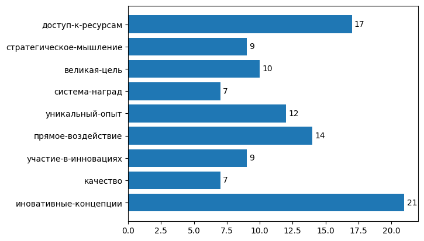

# Word CLoud <!-- omit in toc -->

Решение, которое позволяет получить облако слов из списка коротких ответов на вопросы.

Австорская модель обучена на самостоятельно сделанном датасете русских сиснонимов

Версия README на английском языке находится [здесь](README_en.md)

## Содержание <!-- omit in toc -->
- [Постановка задачи](#постановка-задачи)
- [Структура проекта](#структура-проекта)
- [Идея решения](#идея-решения)
  - [1. Датасеты для обучения](#1-датасеты-для-обучения)
  - [2. Эмбеддинги](#2-эмбеддинги)
  - [3. Кластеризация](#3-кластеризация)
- [Ресурсы](#ресурсы)
- [Разворачивание решения](#разворачивание-решения)
  - [Шаг 1. Клонирование репозитория](#шаг-1-клонирование-репозитория)
  - [Шаг 2. Создание виртуального окружения](#шаг-2-создание-виртуального-окружения)
  - [Шаг 3. Установка зависимостей](#шаг-3-установка-зависимостей)
  - [Шаг 4. Загрузка модели](#шаг-4-загрузка-модели)
- [Демонстрация](#демонстрация)

## Постановка задачи

При проведении опросов важно не только собрать ответы, но и качественно проанализировать их, чтобы понять реальные мотивы и предпочтения людей.

Представим, что сотрудники отвечают на вопрос: «Что мотивирует вас работать больше?» Ответы могут быть самыми разными: «команда», «коллеги», «зарплата», «бабосики», «шеф», «атмосфера», «амбициозные задачи» и т.д. Сырые данные зачастую избыточны и включают множество синонимов, просторечий или даже нецензурной лексики.

Разработать систему на основе ИИ, которая анализирует список пользовательских ответов возвращает понятное и интерпретируемое облако слов.

## Структура проекта

- ___model___ : ссылка на обученную модель
- ___src___ : исходники с кодом, описание класса, решающего задачу
  - ___src/preparation___ : код с парсингом сайта синонимов и формирования датасета
- _demo.ipynb_ : демонстрация использования решения
- _requirements.txt_ : необходимые зависимости

## Идея решения

_Облако слов_ - представление набора слов, агрегированных по смысловым группам. Прежде чем агрегировать слова необходимо их предобработать и получить их векторное представление

### 1. Датасеты для обучения
В интернете очень много датасетов с русскими словами, но мало (или почти нет) датасетов с синонимичными словами. Многие датасеты нацелены на то, что на их основе будут получать эмбеддинги для подбора контектно-схожих слов, что нам не подходит, нам необходимо отбирать близкие по смыслу слова (синонимы). Для этого было решено спарсить синонимы с [сайта синонимов](https://synonyms.su), на котором синонимы представляются не только как единичные слова, но и небольшие фразы (2-4 слова)

### 2. Эмбеддинги

Теперь необходимо получить эмбеддинги слов

Для начала было решено использовать модель _Word2Vec_, но она имеет существенный недостаток: в результате обучения можно получить только векторное представление слов, которые входят в словарь обученной модели, поэтому решено использовать модель _FastText_, которая сохраняет эмбеддинги частей слов (n-грамм) и из них формирует эмбеддинги целых слов, даже не использованных при обучении

Во время предобработки фразы из нескольких слов соединялись дефисом, чтобы сохранялся смысл фразы, а не каждого его слова по-отдельности

Размер эмбеддинга: 150

### 3. Кластеризация

Для кластеризации эмбеддингов полученных слов используется алгоритм кластеризации _DBSCAN_, так как он не требует задания количества кластеров.

В качестве тематики кластера для представления в качестве облака слов, выирается слово с наибольшим числом синонимов, а точнее, то, которое чаще других в вкластере подавалось модели для обучения

## Ресурсы

- слова и их синонимы с сайта [synonyms.su](https://synonyms.su)
- модель [_FastText_](https://radimrehurek.com/gensim/models/fasttext.html) библиотеки _gensim_
- [модель обученная автором](https://drive.google.com/drive/folders/1Q12TJnp_nYx5DqM-nqYiXGMBjhEpcrGF?usp=sharing)
  
## Разворачивание решения

### Шаг 1. Клонирование репозитория

Клонируем репозирорий git:
```bash
git clone https://github.com/YanDanilin/WordCloud
cd WordCloud
```

### Шаг 2. Создание виртуального окружения

Создаем виртуальное окружение
```bash
python3 -m venv venv
```

Активируем виртуальное окружение
- На _Windows_:
```bash
venv\Scripts\activate
```
- На _macOS_ и _Linux_:
```bash
source venv/bin/activate
```

### Шаг 3. Установка зависимостей

Файл _requirements.txt_ должен находиться в корне папки, из которой выполняется команды
```bash
pip install --upgrade pip
pip install -r requirements.txt
```

### Шаг 4. Загрузка модели

Варианты загрузки моделей

- Загрузить собственную модель _FastText_
- **Загрузить модель _FastText_, обученную автором** (рекомендуется)
- Ничего не загружать, при инициализации класса указать в `path_to_model` значение `None`, тогда модель автора загрузится в папку _./modelWordCloud_


## Демонстрация

Рассмотрим работу _WordCloud_ на примере её использования в файле _demo.ipynb_ 

Импортируем класс из файла _./src/WordCloud.py_

``` python
from src.WordCloud import WordCloudFT
```

1. Если имеется собстенная модель, то при создани объекта класса _WordCloud_ в качестве аргумента *path_to_model* передать путь до модели

Мы будем использовать нашу модель (для этого надо передать при инициализации класса `None`)

Если используется данный вариант, то код с использованием класса _WordCloud_ необходимо писать в корневой директории проекта

```python
wc = WordCloudFT(None, path_to_litter='')
```

2. Далее передаем модели список слов с помощью метода `set_word_list`, этот метод принимает либо список слов, либо путь до файла с расширением ___csv___ (слова должны быть расположены в одну колонку, разделитель запятая, первая строчка файла - 0)

```python
wc.set_word_list('./materials/examples.csv')
```
3. Вызываем метод `fit`

```python
wc.fit()
```

4. Выбираем, в каком виде хотим получить вывод нашего облака слов.

Методы для получения списка слов:
- `cloud_dict` - возвращает словарь `<cлово-кластера>: <количество слов в кластере>`
- `cloud_barchart` - выводит горизонтальную столбчатую диаграмму, по вертикальной оси - слова кластеров, по горизонтальной - количество слов в кластерах
- `cloud_cloud` - выводит простое представление в виде облака слов с помощью библиотеки [WordCloud](https://pypi.org/project/wordcloud/)

```python
wc.cloud_cloud()
```


```python
wc.cloud_barchart()
```

