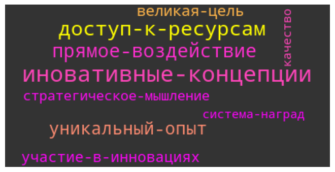
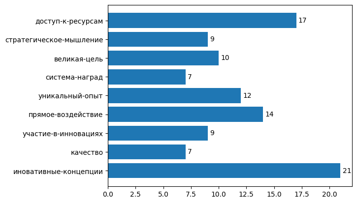

# Word CLoud <!-- omit in toc -->

A solution that allows you to get a cloud of words from a list of short answers to questions

Author`s model trained on self-made russian synonyms dataset

Russian version of readme is [here](README.md)

## Table of contents <!-- omit in toc -->

- [Task](#task)
- [Project structure](#project-structure)
- [Idea](#idea)
  - [1. Training datasets](#1-training-datasets)
  - [2. Embeddings](#2-embeddings)
  - [3. Clusterization](#3-clusterization)
- [Resources](#resources)
- [Solution building](#solution-building)
  - [Step 1. Cloning repository](#step-1-cloning-repository)
  - [Step 2. Making virtual environment](#step-2-making-virtual-environment)
  - [Step 3. Installing requirements](#step-3-installing-requirements)
  - [Step 4. Model downloading](#step-4-model-downloading)
- [Demo](#demo)

## Task

When conducting surveys, it is important not only to collect answers, but also to analyze them qualitatively in order to understand the real motives and preferences of people.

Imagine that employees answer the question: "What motivates you to work more?" The answers can be very different. Raw data is often redundant and includes many synonyms, colloquialisms, or even obscene language.

Develop an AI-based system that analyzes the list of user responses and returns an understandable and interpretable word cloud.

## Project structure

- ___model___ : link to the taught model
- ___src___ : source files with solution
    - ___src/preparation___ : source code with parsing and dataset forming
- _demo.ipynb_ : demonstration of solution
- _requirements.txt_ : required dependencies

## Idea

_Word cloud_ - representation of word list aggregated by meaning. Before aggregating, words need to be preprocessed and embeddings need are needed

### 1. Training datasets
There are a lot of datasets with Russian words on the Internet, but few (or almost none) datasets with synonymous words. Many datasets are aimed at getting embedding based on them to select contextual-similar words, which does not suit us, we need to select words that are close in meaning (synonyms). To do this, it was decided to parse synonyms from the [synonyms site](https://synonyms.su ), in which synonyms are represented not only as single words, but also small phrases (2-4 words)

### 2. Embeddings

Now we need to get worrds embeddings

Firstly, it was decided to use _Word2Vec_ but it has essential disadvantage: after training this model we only can get embeddings of words used for training, therefore _FastText_ is used, it saves embeddings for parts of words (n-gramms) and forms embeddings of full words, even not used while training

While preprocessing a phrase consisting of several words, words connect with a hyphen to save meaning of full phrase not each word

Size of embedding: 150

### 3. Clusterization

To cluster the embeddings of the received words, the clustering algorithm _DBSCAN_ is used, since it does not require specifying the number of clusters.

As the cluster topic to be represented as a word cloud, the word with the largest number of synonyms is selected, or rather, the one that was most often submitted to the training model in the cluster

## Resources

- words and their synonyms from site [synonyms.su](https://synonyms.su)
- model [_FastText_](https://radimrehurek.com/gensim/models/fasttext.html) from package _gensim_
- [model trained by author](https://drive.google.com/drive/folders/1Q12TJnp_nYx5DqM-nqYiXGMBjhEpcrGF?usp=sharing)

## Solution building

### Step 1. Cloning repository

Clone _git_ repository:
```bash
git clone https://github.com/YanDanilin/WordCloud
cd WordCloud
```

### Step 2. Making virtual environment

Make virtual environment
```bash
python3 -m venv venv
```

Activate virtual environment
- _Windows_:
```bash
venv\Scripts\activate
```
- _macOS_ и _Linux_:
```bash
source venv/bin/activate
```

### Step 3. Installing requirements

File _requirements.txt_ must be located in root directory of the project, where the following commands are executed from
```bash
pip install --upgrade pip
pip install -r requirements.txt
```

### Step 4. Model downloading

Variants of downloading

- Download own _FastText_ model
- **Download _FastText_ model trained by the author** (recommended)
- Download nothing, during initialization pass `None` as `path_to_model` parameter, then author`s model will be downloaded in directory _./modelWordCloud_

## Demo

Consider _WordCloud_ work in file _demo.ipynb_

Import class from _./src/WordCloud_
``` python
from src.WordCloud import WordCloudFT
```
1. If there is a custom model, then when creating an object of the _WordCloud_ class, pass the path to the model as an argument *path_to_model*

We will use author\`s model (pass `None` when initializing)

If you use this variant, code with _WordCloud_ usage must be placed in root director of the project

```python
wc = WordCloudFT(None, path_to_litter='')
```

2. Next, we pass the list of words to the model using the `set_word_list` method, this method accepts either a list of words or the path to the ___csv___ file (the words must be arranged in one column, the comma separator, the first line of the file is 0)

```python
wc.set_word_list('./materials/examples.csv')
```

3. Call method `fit`

```python
wc.fit()
```

4. Choose the form in which we want to get the output of our word cloud

Methods for getting a list of words:
- `cloud_dict` - returns the dictionary `<cluster word>: <number of words in the cluster>`
- `cloud_barchart` - displays a horizontal bar chart, on the vertical axis - words of the clusters, on the horizontal - the number of words in the clusters
- `cloud_cloud` - outputs a simple representation in the form of a cloud of words using the library [WordCloud](https://pypi.org/project/wordcloud/)

```python
wc.cloud_cloud()
```



```python
wc.cloud_barchart()
```

